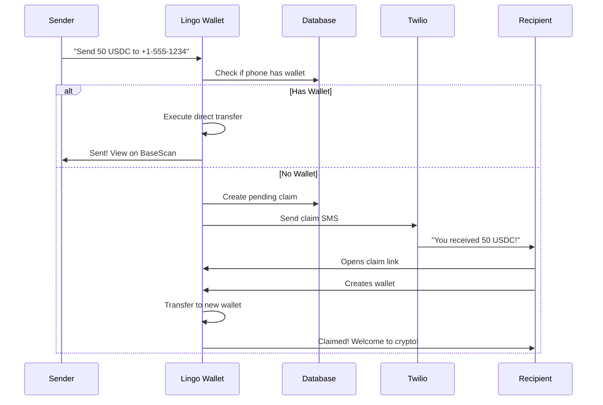

# 🌍 Lingo Wallet

### **Break Language Barriers in Crypto** — The world's first AI-powered multi-language cryptocurrency wallet

<p align="center">
  
  
  
  
  
</p>

<p align="center">
  <strong>🚀 Live Demo:</strong> <a href="https://lingowallet.vercel.app">lingowallet.vercel.app</a>
</p>

---

## 💡 The Problem

**4 billion people** don't speak English as their first language. Yet almost every crypto wallet, DEX, and DeFi app is built for English speakers. Complex interfaces filled with technical jargon create massive barriers to entry.

**Crypto should be for everyone.**

---

## 🎯 The Solution

**Lingo Wallet** reimagines how humans interact with cryptocurrency. Instead of navigating complex UIs, users simply *talk* to their wallet in their native language.

```
🇮🇳 "मुझे 50 USDC भेजना है +1-555-1234 को"
   → Sends 50 USDC to a phone number

🇪🇸 "¿Cuál es mi saldo?"
   → Shows your balance

🇫🇷 "Échange 0.1 ETH contre USDC"
   → Swaps ETH to USDC at best rates

🇯🇵 "0x742d...に100 USDCを送って"
   → Transfers to wallet address
```

**No complex forms. No confusing buttons. Just conversation.**

---

## ✨ Key Innovations

### 🗣️ Conversational AI Interface
Powered by advanced language models, Lingo Wallet understands natural language commands in **8 languages**. It's like having a crypto-savvy friend who speaks your language.

| Language | Example Command |
|----------|-----------------|
| 🇬🇧 English | "Send 100 USDC to mom's phone number" |
| 🇮🇳 Hindi | "मेरा बैलेंस दिखाओ" |
| 🇪🇸 Spanish | "Intercambia todo mi ETH por USDC" |
| 🇫🇷 French | "Envoie 50 USDC à Pierre" |
| 🇧🇷 Portuguese | "Qual é o meu saldo?" |
| 🇩🇪 German | "Sende 25 USDC an diese Adresse" |
| 🇯🇵 Japanese | "残高を確認して" |
| 🇨🇳 Chinese | "把0.5 ETH换成USDC" |

### 📱 Revolutionary Phone-Number Transfers
**Send crypto to anyone with just their phone number** — even if they've never touched crypto before!

```
You: "Send 50 USDC to +1-555-867-5309"

Lingo: "I notice this person doesn't have a wallet yet. 
        I'll send them an SMS so they can claim their crypto.
        
        ✅ 50 USDC reserved
        📱 SMS sent to +1-555-867-5309
        ⏰ They have 7 days to claim"
```

The recipient gets a friendly SMS, creates a wallet with one tap, and claims their funds. **Zero friction onboarding.**

### 🔄 Intelligent DEX Integration
Swap tokens without leaving the conversation. Lingo Wallet uses **LI.FI aggregation** to find the best rates across multiple DEXs automatically.

```
You: "Swap half my ETH to USDC"

Lingo: "I found the best rate for you:
        
        📊 0.25 ETH → 847.32 USDC
        💱 Rate: $3,389.28/ETH
        ⛽ Gas: ~$0.12
        🛣️ Route: Uniswap V3
        
        Ready to swap?"
```

### 🔐 Passwordless Authentication
No seed phrases. No private keys to lose. Users sign in with:
- 📧 Email
- 📱 Phone number  
- 🔵 Google account

Powered by **Privy's embedded wallets** — bank-grade security with consumer-grade simplicity.

---

## 🏗️ Architecture

```
┌─────────────────────────────────────────────────────────────────┐
│                        LINGO WALLET                              │
├─────────────────────────────────────────────────────────────────┤
│                                                                  │
│  ┌──────────────┐    ┌──────────────┐    ┌──────────────┐      │
│  │   Frontend   │    │   AI Engine  │    │  Blockchain  │      │
│  │   Next.js    │◄──►│   Claude/    │◄──►│    Layer     │      │
│  │   React      │    │   GPT-4      │    │              │      │
│  └──────────────┘    └──────────────┘    └──────────────┘      │
│         │                   │                   │               │
│         ▼                   ▼                   ▼               │
│  ┌──────────────┐    ┌──────────────┐    ┌──────────────┐      │
│  │    Privy     │    │   Google     │    │   LI.FI      │      │
│  │    Auth      │    │  Translate   │    │   DEX Agg    │      │
│  └──────────────┘    └──────────────┘    └──────────────┘      │
│         │                                       │               │
│         ▼                                       ▼               │
│  ┌──────────────┐                        ┌──────────────┐      │
│  │   Supabase   │                        │    Base      │      │
│  │   Database   │                        │    Chain     │      │
│  └──────────────┘                        └──────────────┘      │
│         │                                                       │
│         ▼                                                       │
│  ┌──────────────┐                                              │
│  │   Twilio     │                                              │
│  │   SMS        │                                              │
│  └──────────────┘                                              │
│                                                                  │
└─────────────────────────────────────────────────────────────────┘
```

---

## 🛠️ Tech Stack

| Layer | Technology | Why We Chose It |
|-------|------------|-----------------|
| **Frontend** | Next.js 16, React, TypeScript | Server components, type safety |
| **Styling** | TailwindCSS | Rapid UI development |
| **Auth** | Privy | Seamless embedded wallets |
| **Blockchain** | Base (L2) | Low fees (~$0.01), fast confirmations |
| **Transactions** | Viem | Modern, type-safe Ethereum library |
| **DEX** | LI.FI | Best rates across all DEXs |
| **Database** | Supabase | Real-time, PostgreSQL power |
| **SMS** | Twilio | Reliable global delivery |
| **Translation** | Google Cloud Translate | 100+ language support |
| **AI** | Claude / GPT-4 | Natural language understanding |

---

## 🚀 Getting Started

### Prerequisites

- Node.js 18+
- npm or yarn
- API keys for: Privy, Supabase, Twilio, Google Translate

### Installation

```bash
git clone https://github.com/penguinpecker/lingowallet.git
cd lingowallet
npm install
cp .env.example .env.local
npm run dev
```

### Environment Variables

```env
NEXT_PUBLIC_PRIVY_APP_ID=your-privy-app-id

NEXT_PUBLIC_SUPABASE_URL=https://your-project.supabase.co
NEXT_PUBLIC_SUPABASE_ANON_KEY=your-anon-key

TWILIO_ACCOUNT_SID=your-account-sid
TWILIO_AUTH_TOKEN=your-auth-token
TWILIO_PHONE_NUMBER=+1234567890

GOOGLE_TRANSLATE_API_KEY=your-api-key

OPENAI_API_KEY=your-openai-key
ANTHROPIC_API_KEY=your-anthropic-key
```

### Database Setup

Run this SQL in your Supabase dashboard:

```sql
CREATE TABLE phone_wallets (
  id UUID DEFAULT gen_random_uuid() PRIMARY KEY,
  phone_hash TEXT UNIQUE NOT NULL,
  wallet_address TEXT NOT NULL,
  created_at TIMESTAMP WITH TIME ZONE DEFAULT NOW()
);

CREATE TABLE pending_claims (
  id UUID DEFAULT gen_random_uuid() PRIMARY KEY,
  phone_hash TEXT NOT NULL,
  amount TEXT NOT NULL,
  token TEXT NOT NULL,
  sender_address TEXT NOT NULL,
  claim_token TEXT UNIQUE NOT NULL,
  claimed BOOLEAN DEFAULT FALSE,
  expires_at TIMESTAMP WITH TIME ZONE NOT NULL,
  created_at TIMESTAMP WITH TIME ZONE DEFAULT NOW()
);

CREATE TABLE transaction_history (
  id UUID DEFAULT gen_random_uuid() PRIMARY KEY,
  tx_hash TEXT,
  wallet_address TEXT NOT NULL,
  type TEXT NOT NULL,
  status TEXT NOT NULL,
  token_in TEXT,
  token_out TEXT,
  amount_in TEXT,
  amount_out TEXT,
  counterparty_address TEXT,
  counterparty_phone TEXT,
  chain TEXT DEFAULT 'base',
  description TEXT,
  language TEXT DEFAULT 'en',
  original_command TEXT,
  error_message TEXT,
  created_at TIMESTAMP WITH TIME ZONE DEFAULT NOW(),
  confirmed_at TIMESTAMP WITH TIME ZONE
);

CREATE INDEX idx_phone_wallets_hash ON phone_wallets(phone_hash);
CREATE INDEX idx_pending_claims_phone ON pending_claims(phone_hash);
CREATE INDEX idx_pending_claims_token ON pending_claims(claim_token);
CREATE INDEX idx_tx_history_wallet ON transaction_history(wallet_address);
```

### Configure Privy

1. Create app at [dashboard.privy.io](https://dashboard.privy.io)
2. Add allowed domains: `http://localhost:3000`, your production URL
3. Enable login methods: Email, Google, Phone

---

## 📁 Project Structure

```
lingowallet/
├── app/
│   ├── api/
│   │   ├── chat/
│   │   ├── get-balance/
│   │   ├── translate/
│   │   ├── send-sms/
│   │   └── transactions/
│   ├── claim/[token]/
│   ├── page.tsx
│   ├── layout.tsx
│   └── providers.tsx
├── components/
│   └── TransactionHistory.tsx
├── lib/
│   ├── blockchain.ts
│   ├── bridge.ts
│   ├── evm-transactions.ts
│   ├── phone-wallet.ts
│   ├── sms.ts
│   └── transaction-history.ts
└── public/
```

---

## 📱 User Flow: Phone Transfer



---

## 🔒 Security

| Feature | Implementation |
|---------|----------------|
| **Phone Privacy** | SHA-256 hashed before storage |
| **Claim Expiry** | 7-day automatic expiration |
| **User Confirmation** | All transactions require explicit approval |
| **Key Management** | Privy's MPC — no exposed seed phrases |
| **API Security** | Environment variables, never committed |

---

## 🗺️ Roadmap

- [x] Multi-language chat interface
- [x] Phone number transfers with SMS
- [x] DEX swaps via LI.FI
- [x] Transaction history
- [x] Real-time balance updates
- [ ] Voice commands
- [ ] Cross-chain bridging UI
- [ ] NFT support
- [ ] Recurring payments
- [ ] Fiat on-ramp integration
- [ ] Mobile app (React Native)

---

## 🤝 Contributing

We believe crypto should be accessible to everyone. Contributions are welcome!

```bash
git checkout -b feature/amazing-feature
git commit -m 'Add amazing feature'
git push origin feature/amazing-feature
```

---

## 📄 License

MIT License — see [LICENSE](LICENSE) for details.

---

## 🙏 Built With

- [Privy](https://privy.io/) — Wallet infrastructure
- [Base](https://base.org/) — Ethereum L2
- [LI.FI](https://li.fi/) — DEX aggregation
- [Supabase](https://supabase.com/) — Backend database
- [Twilio](https://twilio.com/) — SMS delivery

---

<p align="center">
  <strong>🌍 Crypto has no borders. Neither should language.</strong>
</p>

<p align="center">
  Made with ❤️ for the global community
</p>
